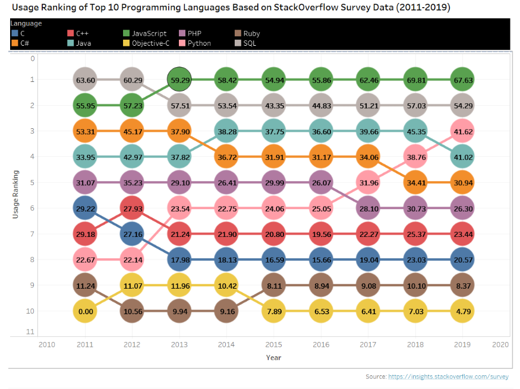
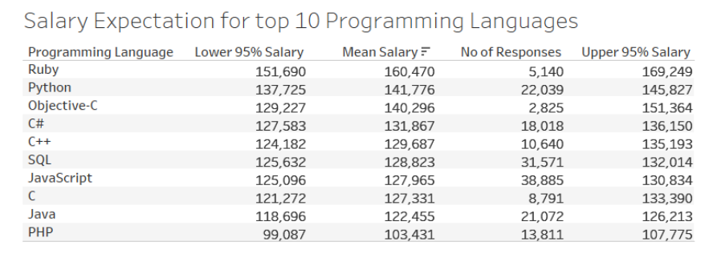

# Write A Data Science Blog Post

## Introduction
Given the large number of industries and problems that fall under the umbrella of Data Science, there are a lot of different tools and individual nuances of a particular company or industry for finding solutions. However, there's actually a common process used to find many solutions in Data Science. This process is known as the Cross Industry Standard Process for Data Mining or CRISP-DM. This process has been an industry standard for analyzing data for years and it has six major phases.

### 1. Business Understanding
We want to analyze the trends, correlations and expectations of top 10 programmming languages in 2019. So we start with the following questions in mind: 
1. Which languages were most popular in each year from 2011 to 2019? Which language has gained most usage during the period of 2011-2019? Which language has lost the biggest ground duing this same period?
1. What are the correlations between different programming languages in 2019? What are the correlations between languages and developer types? What were the correlations between different programming languages in 2011?
1. What are the salary expectations for a programming language user in 2019? What was the salary expectations for a programming language user in 2011?
### 2. Data Understanding
Here we used the StackOverflow survey data from year 2011 to year 2019 to attempt to answer our questions of interest. We did 1. and 2. in tandem in this case, using the data to help us arrive at our questions of interest. Since the stucture of survey data varies a lot each year, so we need to look into the structure more deeply to get a good understanding of the problems in hand. 
### 3. Data Preparation
This is commonly denoted as 80% of the process. From working with missing data to finding a way to work with categorical variables, and we didn't even look for outliers or attempt to find points we were especially poor at predicting. There was ton more we could have done to wrangle the data, but you have to start somewhere, and then you can always iterate.
### 4. Modeling
We were finally able to model the data, but we had some back and forth with step 3. before we were able to build a model that had okay performance. There still may be changes that could be done to improve the model we have in place. From additional feature engineering to choosing a more advanced modeling technique, we did little to test that other approaches were better within this lesson.  Since none of our questions  requires machine learning, descriptive or inferential statistics are used to create a compelling answers to all questions.
### 5. Evaluation
Results are the findings from our wrangling and modeling. They are the answers you found to each of the questions.
1. **Trends of top 10 programming languages (2011–2019):**
 If we look at the usage ranking of top 10 programming languages from 2011 to 2019, we would see some interesting trends. JavaScript and SQL remain the top two programming languages for quite some time, but Python seems the fastest growing major programming language. The booming interest in Artificial Interest and machine learning is fueling the acceleration of interest in Python. During the last three years, Python has edged out PHP, C# and Java and it is now the third used language among the developers. C# seems to be losing the ground among the developers faster than other major programming language.
	
1. **Correlated programming languages:**
Since most developers tend to use multiple programming languages, there is some correlation between different programming languages. So if a developer is using C, there is a strong probability that he/she is also using C++. Developers also tend to use JavaScript, PHP and SQL together. There is also some strong correlations between C# and SQL and C,C++ and Python.
	
1. **Salary Expectation:**
By analyzing developer’s annual salary and their programming language usages, we can get the expectation in learning top 10 programming languages in terms of mean salaries and 95% confidence limits. The 95% confidence limits depend on the number of responses. For higher number of responses, the 95% confidence limit gets narrower and for lower number of responses, the 95% confidence limit gets wider. From our analysis, developers who are using Ruby programming language are getting the highest mean salary, followed by Python and Objective-C users.
	
### 6. Deployment
Deploying can occur by moving our approach into production or by using our results to persuade others within a company to act on the results. Communication is such an important part of the role of a data scientist. Here we have publish our findings to the online community by a [Medium blog post](https://medium.com/@hasan.ahmedmonjurul/top-10-programming-languages-in-2019-fbe63b059319) and to show how we get our results using the [notebook](Stack_Overflow_Annual_Developer_Survey.ipynb) on this github repository.

