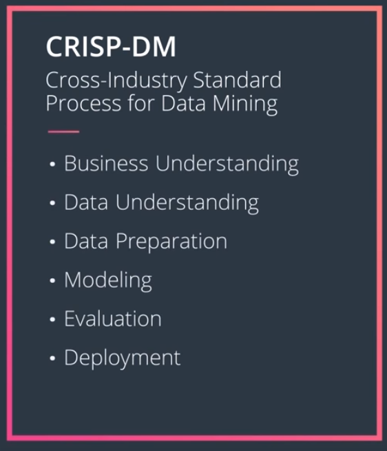

# Write A Data Science Blog Post

## Introduction
Given the large number of industries and problems that fall under the umbrella of Data Science, there are a lot of different tools and individual nuances of a particular company or industry for finding solutions. However, there's actually a common process used to find many solutions in Data Science. This process is known as the Cross Industry Standard Process for Data Mining or CRISP-DM. This process has been an industry standard for analyzing data for years and it has six major phases.

